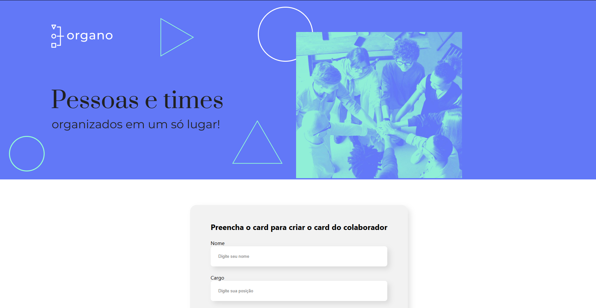

<p align="center">
  
  
</p>

<p align="center">
  
</p>

## 📖 Sobre o Projeto

O **Organo** é uma plataforma simples e intuitiva para o gerenciamento de times. Este projeto foi desenvolvido como parte do curso da Alura, com o objetivo de praticar os fundamentos do React, incluindo a criação de componentes, gerenciamento de estado (state) e passagem de propriedades (props).

A aplicação permite que um usuário adicione novos membros à equipe, especificando nome, cargo, imagem e o time ao qual pertencem, e exibe todos os membros organizados visualmente em seus respectivos times.

## ✨ Funcionalidades

* **Formulário dinâmico** para criação de cards de membros.
* **Organização visual** dos membros em seus respectivos times.
* **Design responsivo** e limpo, focado na usabilidade.
* **Validação de formulário** e manipulação de eventos.

## 🚀 Deploy

O projeto está disponível para visualização e interação através do GitHub Pages.

<p align="center">
  <a href="https://[edson66].github.io/[projeto-organograma]/" target="_blank">
    
  </a>
</p>

## 🛠️ Tecnologias Utilizadas

As seguintes ferramentas e tecnologias foram usadas na construção do projeto:

<p align="center">
  
  
  
  
</p>

## ⚙️ Como Rodar o Projeto Localmente

Este projeto foi inicializado com `Create React App`. Para rodá-lo em seu ambiente de desenvolvimento local, certifique-se de ter o [Node.js](https://nodejs.org/) e o [npm](https://www.npmjs.com/) instalados.

Em seguida, siga os passos abaixo no seu terminal:

```bash
# 1. Clone este repositório
$ git clone [https://github.com/](https://github.com/)[edson66]/[projeto-organograma].git

# 2. Navegue até a pasta do projeto
$ cd [react-organograma]

# 3. Instale as dependências necessárias
$ npm install

# 4. Inicie o servidor de desenvolvimento
$ npm start
