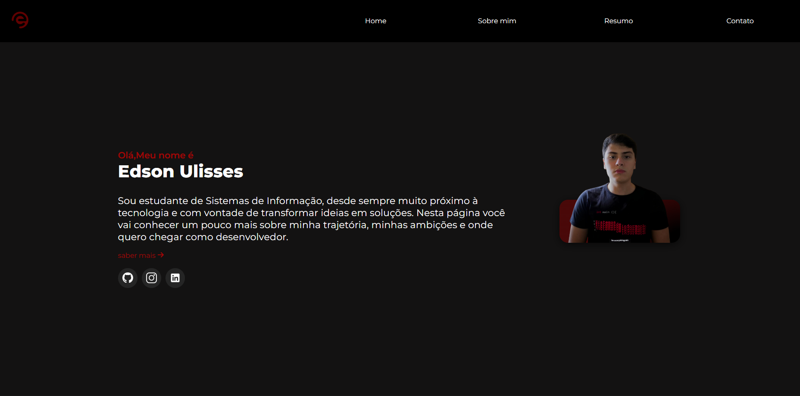

# Meu Portfólio Pessoal


## 📄 Sobre o Projeto

Este é o repositório do meu portfólio pessoal, um projeto desenvolvido para apresentar minhas habilidades, projetos e informações de contato de uma forma moderna e interativa. O site foi construído do zero, com foco em um design responsivo e funcionalidades dinâmicas criadas com JavaScript puro.

## 📸 Preview

[Adicione aqui um screenshot ou um GIF do seu portfólio em ação! Para fazer isso, crie uma pasta `gifs` no seu projeto, adicione a imagem/gif nela e altere o link abaixo.]



## ✨ Funcionalidades

O projeto conta com diversas funcionalidades interativas implementadas com JavaScript:

* **Menu Hambúrguer Responsivo:** Menu de navegação que se adapta a telas menores, com animação de abertura e fechamento.
* **Slider de Projetos:** Um slider dinâmico na seção de projetos, que permite a navegação entre as diferentes categorias (Web, Python, Java).
* **Highlight Deslizante:** Um efeito visual no menu de filtros do slider, onde o indicador de item ativo desliza suavemente entre as opções, proporcionando uma experiência de usuário fluida.
* **Formulário de Contato Funcional:**
    * Envio de mensagens sem recarregar a página (utilizando a API Fetch).
    * Integração com o serviço **Formspree** para o envio de e-mails.
    * Feedback em tempo real para o usuário (mensagens de "enviando...", "sucesso" ou "erro").
* **Otimização de Performance:** Uso da técnica de `debounce` no evento de redimensionamento da tela para garantir que os cálculos de layout sejam feitos de forma eficiente, sem sobrecarregar o navegador.
* **Compatibilidade Cross-Browser:** Inclui uma solução específica (via meta tag e CSS) para corrigir o bug de renderização do modo escuro forçado no navegador Samsung Internet.

## 🛠️ Tecnologias Utilizadas

As seguintes ferramentas e tecnologias foram usadas na construção do projeto:

* **HTML5:** Estruturação semântica do conteúdo.
* **CSS3:** Estilização, layout responsivo (Flexbox/Grid), animações e variáveis CSS.
* **JavaScript (ES6+):** Manipulação do DOM, interatividade, eventos, lógica do slider e envio de formulário assíncrono (AJAX).
* **Git & GitHub:** Versionamento de código e hospedagem.
* **Formspree:** Serviço de backend para o formulário de contato.

## 🚀 Como Executar o Projeto

Para visualizar o projeto localmente, siga estes passos:

1.  Clone o repositório:
    ```bash
    git clone [link-do-seu-repositorio.git]
    ```
2.  Navegue até a pasta do projeto:
    ```bash
    cd [nome-da-pasta]
    ```
3.  Abra o arquivo `index.html` no seu navegador.
    * (Recomendado) Use a extensão **Live Server** do VS Code para uma melhor experiência, que recarrega a página automaticamente ao salvar.

## 🧠 Aprendizados

Este projeto foi uma grande oportunidade para aprofundar meus conhecimentos em JavaScript puro e na resolução de problemas complexos de front-end. Alguns dos principais aprendizados foram:

* Manipulação avançada do DOM para criar componentes interativos do zero.
* Lógica de cálculo de `transform` em CSS para criar um slider funcional e responsivo.
* Implementação de envio de formulários assíncronos com a `fetch` API, tratando respostas de sucesso e erro.
* A importância da otimização de performance, especialmente ao lidar com eventos como `resize`.
* Debugging de problemas de compatibilidade entre diferentes navegadores (cross-browser).

## 📬 Contato

**[Edson ULisses de Melo Sobrinho]**

* **Email:** [edsonulissesr1@gmail.com]
* **LinkedIn:** [https://www.linkedin.com/in/edson-sobrinho-103657372]
* **GitHub:** [https://github.com/edson66]